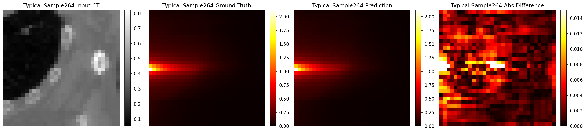
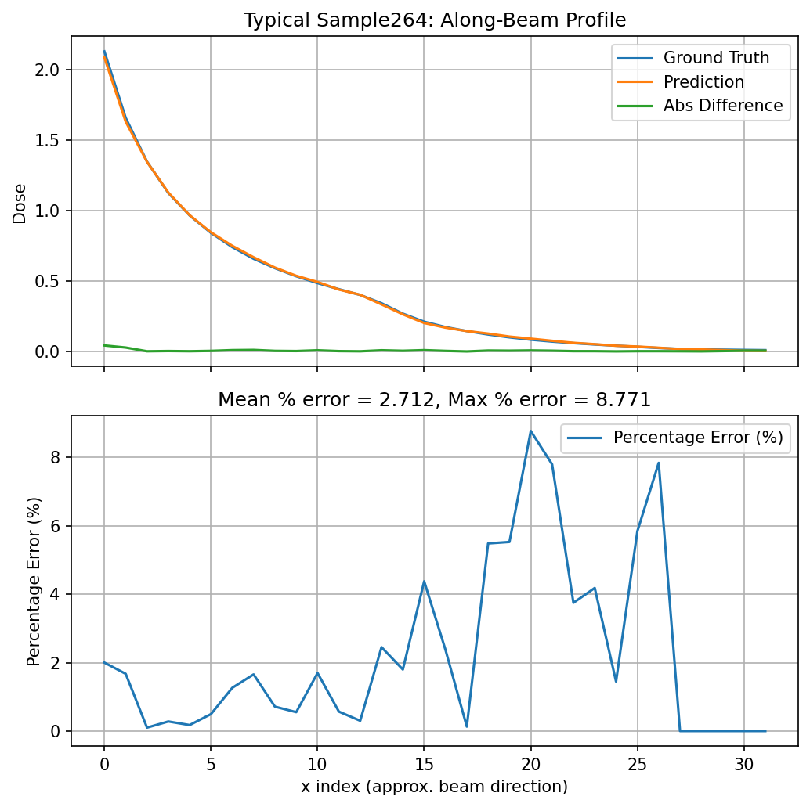
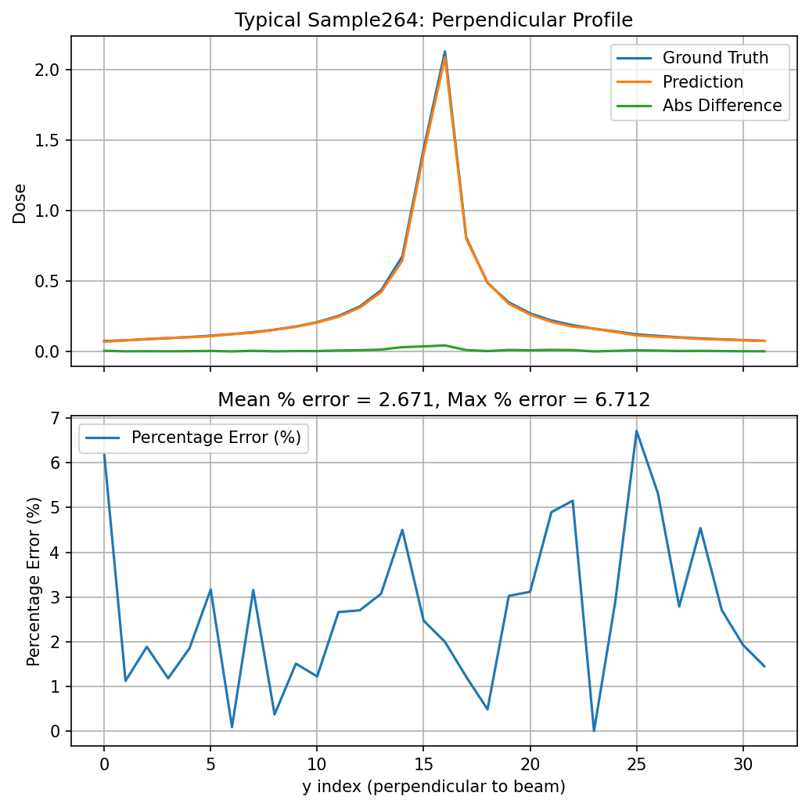
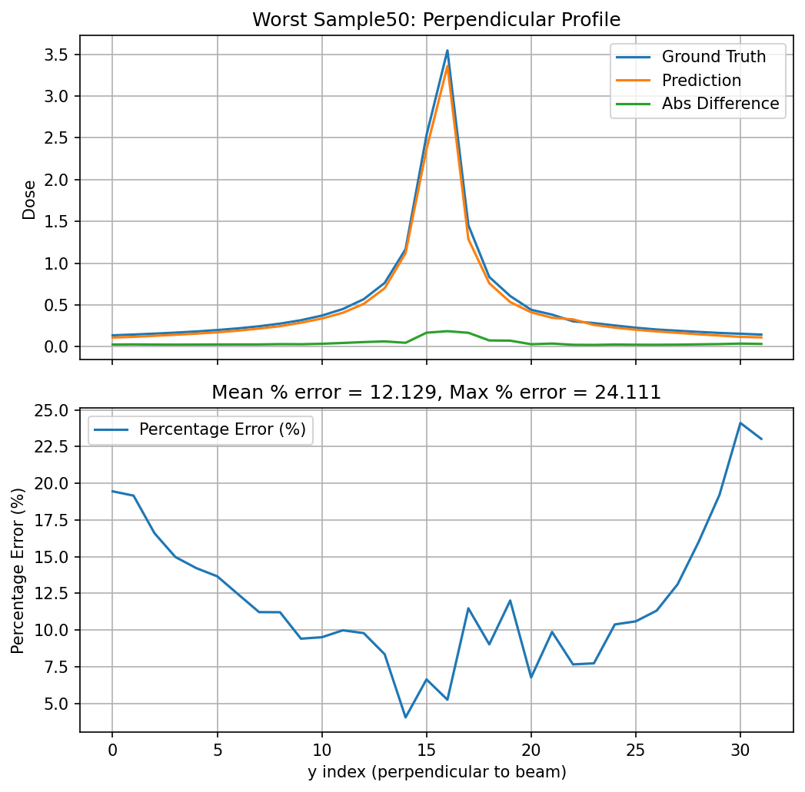
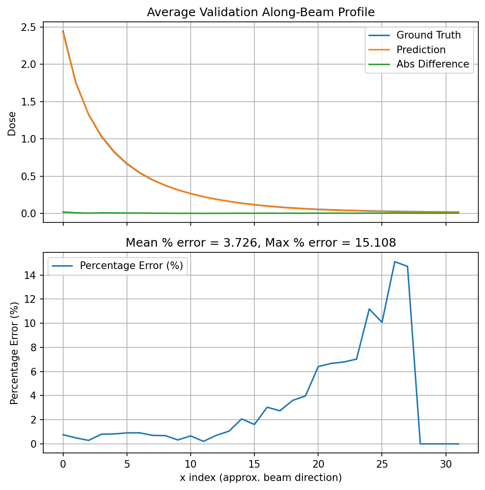
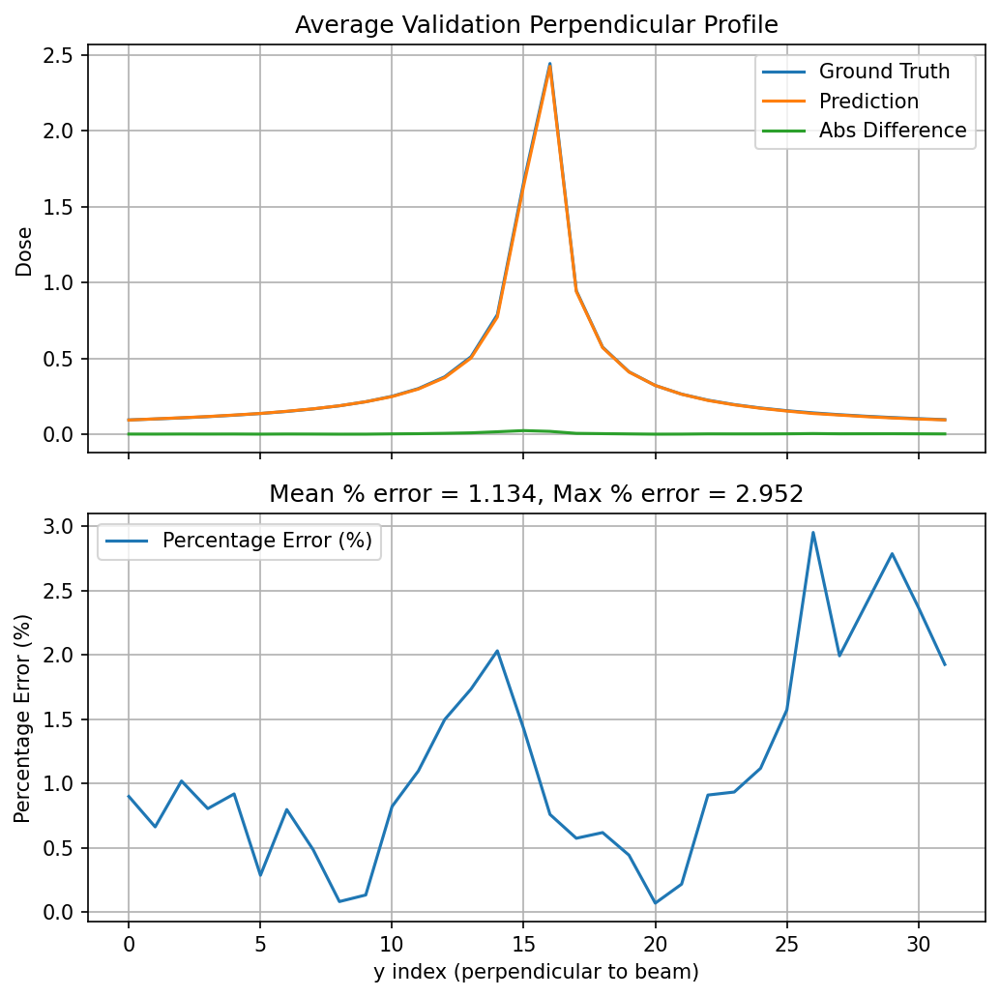

# CT-to-Dose Prediction: Regression and Flow on Paired 2D/3D Cubes

This project studies the mapping from paired CT cubes to dose cubes on a `32×32×32` dataset, using both regression-based and flow-based approaches.

The project currently includes:

- **Phase 1**: pilot experiments in 2D and 3D
- **Phase 2**: analysis and interpretation of pilot results
- **Phase 3**: a larger-scale train/validation development run for the 3D flow model, including continuation beyond 30 epochs, controlled hyperparameter tuning, wandb / Optuna-based search, and validation error analysis

---

## Project goal

The goal is to learn a mapping from **CT cubes** to **dose cubes**:

`CT cube → dose cube`

and to understand how well flow-based models can reconstruct the beam-shaped dose structure.

---

## Current project phases

### Phase 1 — Pilot experiments
This phase focused on:
- building the 2D and 3D pipelines
- verifying that the task is learnable
- establishing initial regression and flow baselines

### Phase 2 — Analysis of pilot results
This phase focused on:
- training stability checks
- normalization and scaling analysis
- prediction / ground-truth / difference visualization
- beam-based profile analysis
- flow behavior visualization

### Phase 3 — Larger-scale development run
This phase moved beyond the pilot setup and used:
- **6 training cases**
- **2 validation cases**
- **2 fully held-out test cases**

At the sample level, the current development run uses:
- **2000 training samples**
- **500 validation samples**

The hold-out test set is intentionally left untouched for later formal evaluation.

---

## Data setup

The project uses paired `32×32×32` CT-dose cubes.

### Pilot-scale setup
Earlier pilot experiments used smaller subsets such as:
- 64 training samples
- 32 test samples

These experiments were mainly used for feasibility checks and early model understanding.

### Current development setup
The current larger-scale flow run uses:
- **2000 training samples**
- **500 validation samples**
- hold-out test set reserved for later use

More details are documented in `data/README.md`.

---

## Current best phase-3 result

### Best tuned configuration
- `lr = 5e-4`
- `base_ch = 24`
- `batch_size = 2`
- continuation to `50` epochs

### Best validation result
- **best epoch:** `43`
- **best validation loss:** `1.5e-05`

### Final evaluation result
- **final validation MSE:** `1.7e-05`
- **final validation MAE:** `0.002662`

---

## Main observations

### Training behavior
- training is stable overall on the current `2000 / 500` setup
- no strong persistent overfitting signal is visible
- continuation beyond 30 epochs gives meaningful additional improvement
- controlled tuning improves the result further

### Validation reconstruction
Using the best tuned checkpoint, validation examples show that:
- the main beam-shaped dose structure is reconstructed very well
- the beam entrance region is localized correctly
- the along-beam decay pattern is captured especially well
- the perpendicular structure is also reconstructed well for typical cases

### Validation error analysis
- **best case** global relative error: **`2.91%`**
- **typical case** global relative error: **`5.48%`**
- **worst case** global relative error: **`11.86%`**
- **typical case** profile percentage errors:
  - along-beam mean: **`2.71%`**
  - perpendicular mean: **`2.67%`**
- **worst case** profile percentage errors:
  - along-beam mean: **`3.06%`**
  - perpendicular mean: **`7.45%`**
- **averaged validation profiles**:
  - along-beam mean percentage error: **`3.73%`**
  - perpendicular mean percentage error: **`1.13%`**

### Wandb / Optuna tuning
A first tool-based tuning step was also completed with both Weights & Biases and Optuna.

Both the wandb runs and the Optuna study pointed to the same strong hyperparameter region:
- `base_ch = 24`
- learning rate around **`4e-4` to `5e-4`**

The Optuna-selected configuration (`lr ≈ 4.2e-4`, `base_ch = 24`, `batch_size = 2`) was then trained more fully to `50` epochs, but it did not outperform the current manually tuned best model.

So the current best full training result still remains:
- `lr = 5e-4`
- `base_ch = 24`
- `batch_size = 2`
- continuation to `50` epochs

### Interpretation
The current flow model is no longer only a pilot proof of concept.  
On the larger train/validation setup, it trains stably, improves beyond 30 epochs, benefits from controlled tuning, and is further supported by wandb / Optuna-based search.

At the same time, the error is still not consistently below 1%, so the current result should be understood as a **strong development-stage result** rather than the final formal evaluation.

---

## Key figures

### 1. Typical validation cross-section


### 2. Typical validation along-beam profile with percentage error


### 3. Typical validation perpendicular profile with percentage error


### 4. Worst-case cross-section


### 5. Worst-case perpendicular profile with percentage error


### 6. Average validation along-beam profile


### 7. Average validation perpendicular profile


---

## Repository structure

```text
ct2dose-project/
├── README.md
├── .gitignore
├── data/
│   ├── README.md
│   └── splits/
├── notebooks/
│   ├── 2d/
│   └── 3d/
├── analysis/
│   ├── day1/
│   ├── day2/
│   ├── day3/
│   ├── day4/
│   ├── phase2/
│   ├── phase3/
│   ├── phase3_error_analysis/
│   ├── phase3_continuation/
│   ├── phase3_tuning_round1/
│   ├── phase3_best_tuned_error_analysis/
│   └── phase3_wandb_optuna/
├── meeting/
│   └── 2026-04-16/
├── docs/
│   └── figures/
├── scripts/
├── outputs/
└── raw_data/