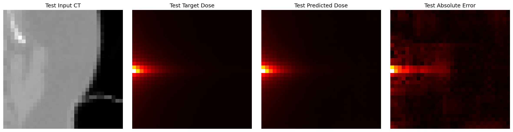
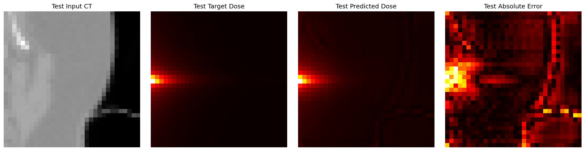
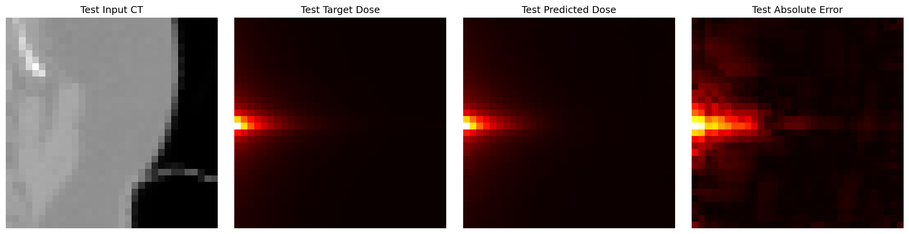
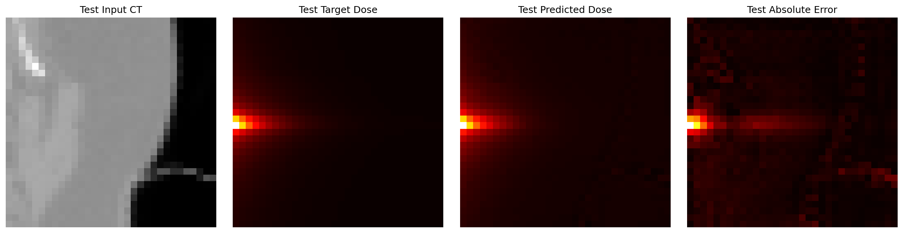
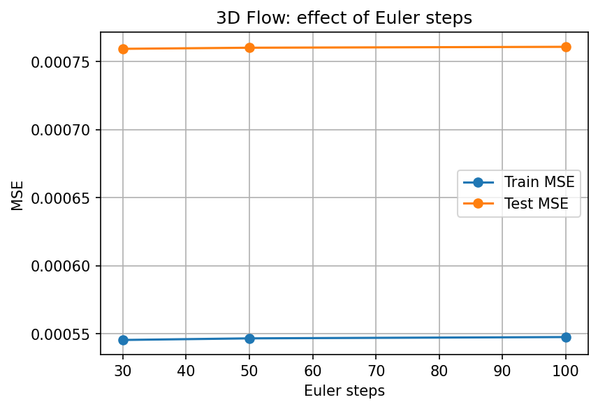
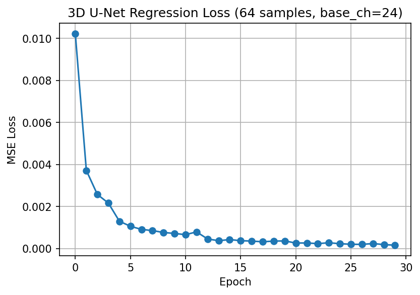
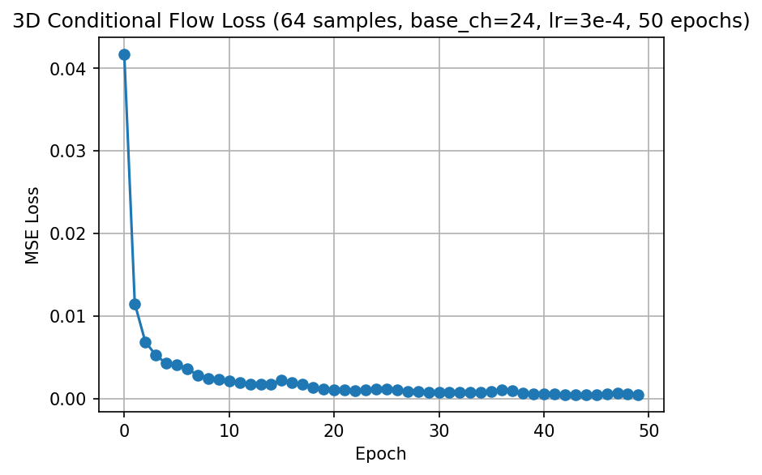

# CT-to-Dose Prediction: Regression vs Flow on Paired 2D/3D Cubes

This project studies the mapping from paired CT cubes to dose cubes on a `32×32×32` dataset, and compares regression-based and flow-based approaches under controlled 2D and 3D settings.

## Project goal

The goal is to learn a mapping

$$
\text{CT cube} \rightarrow \text{dose cube}
$$

and to understand how far conditional flow models can approach strong regression baselines.

---

## Data setup

The project uses paired `32×32×32` CT-dose cubes.

A patient-level split was created:
- first 8 case folders for training
- last 2 case folders for testing

This avoids train/test leakage across patients.

More details are documented in [`data/README.md`](data/README.md).

---

## Repository structure

```text
ct2dose-project/
├── README.md
├── .gitignore
├── notebooks/
│   ├── 2d/
│   │   └── ct2dose_2d_baselines.ipynb
│   └── 3d/
│       └── ct2dose_3d_regression_and_flow.ipynb
├── data/
│   ├── README.md
│   └── splits/
│       ├── train_pairs_2d.json
│       ├── test_pairs_2d.json
│       ├── train_pairs_3d.json
│       └── test_pairs_3d.json
├── docs/
│   └── figures/
│       ├── regression_2d_best.png
│       ├── flow_2d_best.png
│       ├── regression_3d_best.png
│       ├── flow_3d_best.png
│       ├── flow_euler_check.png
│       ├── regression_3d_loss.png
│       └── flow_3d_loss.png
└── outputs/
```
---

## 2D results

In the 2D setup, the CT-to-dose mapping is clearly learnable.

The 2D U-Net regression baseline performs better than the 2D conditional flow baseline under the current setup.

### Best 2D regression example



### Best 2D flow example



---

## 3D results

In 3D, the CT-to-dose mapping is also learnable.

A strong 3D regression baseline was established and used as the main reference model. Several 3D conditional flow baselines were then tested under comparable settings.

### Best 3D regression baseline

**Setup**
- 64 training samples / 32 test samples
- 3D U-Net
- `base_ch = 24`

**Metrics**
- Train MSE: `0.000250`
- Test MSE: `0.000319`
- Train MAE: `0.010088`
- Test MAE: `0.010948`



### Best 3D flow baseline

**Setup**
- 64 training samples / 32 test samples
- conditional 3D U-Net flow
- `base_ch = 24`
- `batch_size = 2`
- `lr = 3e-4`
- `50 epochs`
- `30 Euler steps`

**Metrics**
- Train MSE: `0.000404`
- Test MSE: `0.000600`
- Train MAE: `0.013144`
- Test MAE: `0.015693`



---

## Additional analysis

### Euler step check

The same 3D flow checkpoint was re-evaluated with different Euler step counts:
- 30
- 50
- 100

Result: the metrics and visual outputs remained almost unchanged.

This suggests that the remaining gap between 3D flow and 3D regression is **not mainly caused by insufficient Euler sampling resolution**.



---

## Training curves

### 3D regression loss



### 3D flow loss



---

## Main conclusion

The current stage supports the following conclusions:

- the paired CT-dose pipeline works correctly
- the CT-to-dose mapping is learnable in both 2D and 3D
- regression is currently the stronger baseline
- conditional flow is feasible and improves substantially with a more stable training setup
- the remaining flow-vs-regression gap is more strongly related to optimization stability than to Euler sampling resolution

---

## Notes

The large raw cube data are **not** included in this repository.  
Only lightweight split files, notebooks, and representative figures are tracked here.
