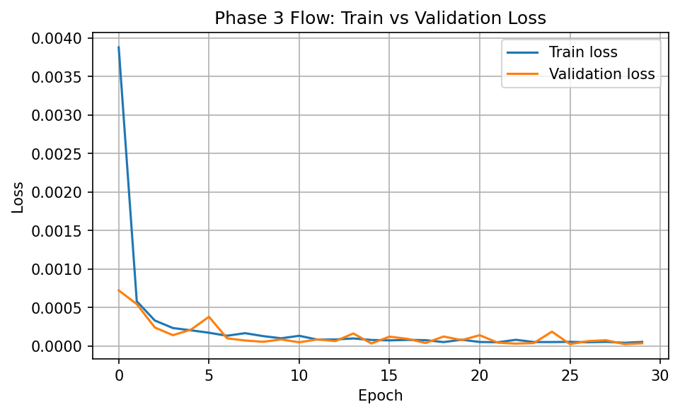
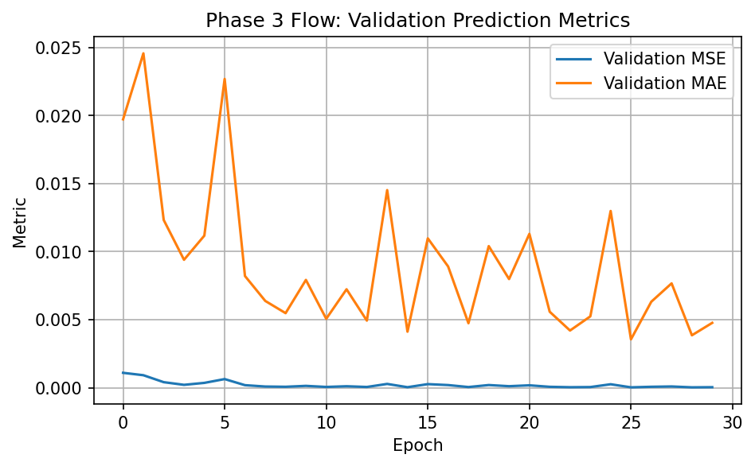
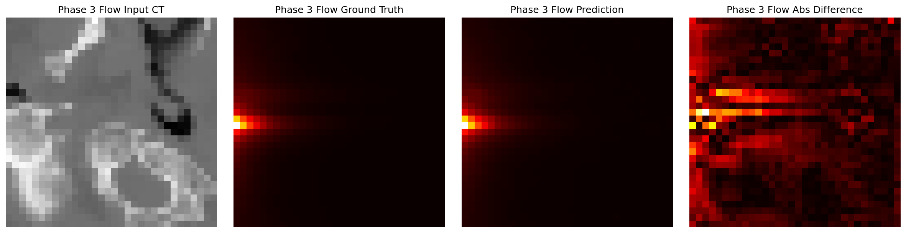
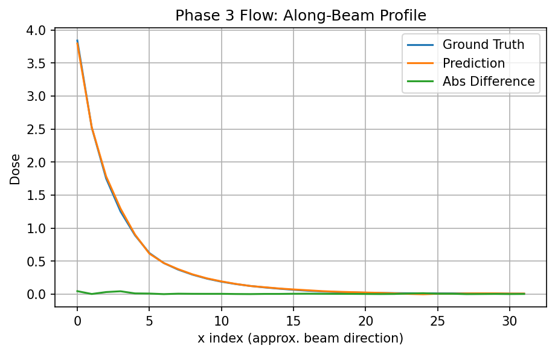
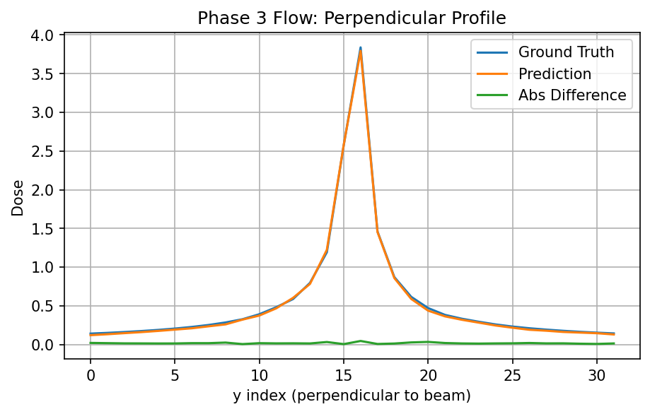

# CT-to-Dose Prediction: Regression and Flow on Paired 2D/3D Cubes

This project studies the mapping from paired CT cubes to dose cubes on a `32×32×32` dataset, using both regression-based and flow-based approaches.

The project currently includes:

- **Phase 1**: pilot experiments in 2D and 3D
- **Phase 2**: analysis and interpretation of pilot results
- **Phase 3**: a larger-scale train/validation development run for the 3D flow model

---

## Project goal

The goal is to learn a mapping

\[
\text{CT cube} \rightarrow \text{dose cube}
\]

and to understand how well flow-based models can reconstruct the beam-shaped dose structure.

---

## Current project phases

### Phase 1 — Pilot experiments
This phase focused on:
- building the 2D and 3D pipelines
- verifying that the task is learnable
- establishing initial regression and flow baselines

### Phase 2 — Analysis of pilot results
This phase focused on:
- training stability checks
- normalization and scaling analysis
- prediction / ground-truth / difference visualization
- beam-based profile analysis
- flow behavior visualization

### Phase 3 — Larger-scale development run
This phase moved beyond the pilot setup and used:
- **6 training cases**
- **2 validation cases**
- **2 fully held-out test cases**

At the sample level, the current development run uses:
- **2000 training samples**
- **500 validation samples**

The hold-out test set is intentionally left untouched for later formal evaluation.

---

## Data setup

The project uses paired `32×32×32` CT-dose cubes.

### Pilot-scale setup
Earlier pilot experiments used smaller subsets such as:
- 64 training samples
- 32 test samples

These experiments were mainly used for feasibility checks and early model understanding.

### Current development setup
The current larger-scale flow run uses:
- **2000 training samples**
- **500 validation samples**
- hold-out test set reserved for later use

More details are documented in `data/README.md`.

---

## Current best phase-3 flow result

### Configuration
- conditional 3D U-Net flow
- `base_ch = 24`
- `batch_size = 2`
- `lr = 3e-4`
- `30 epochs`

### Best validation result
- **best epoch:** `26`
- **best validation loss:** `2.3445e-05`

### Final epoch result
- **final train loss:** `5.2268e-05`
- **final validation loss:** `3.3849e-05`
- **final validation MSE:** `4.0283e-05`
- **final validation MAE:** `0.004768`

---

## Main observations

### Training behavior
- train and validation losses decrease strongly overall
- no strong persistent overfitting signal is visible on the current `2000 / 500` setup

### Validation reconstruction
Using the best phase-3 checkpoint, validation examples show that:
- the main beam-shaped dose structure is reconstructed well
- the beam entrance region is localized correctly
- the along-beam decay pattern is reproduced accurately
- the perpendicular peak structure is also captured well

### Interpretation
The current flow model is no longer only a pilot proof of concept.  
On the larger train/validation setup, it trains stably and reconstructs the main beam-related dose structure well on validation examples.

---

## Key figures

### 1. Phase-3 train vs validation loss


### 2. Phase-3 validation metrics


### 3. Representative validation reconstruction


### 4. Along-beam profile on validation example


### 5. Perpendicular profile on validation example


---

## Repository structure

```text
ct2dose-project/
├── README.md
├── .gitignore
├── data/
│   ├── README.md
│   └── splits/
├── notebooks/
│   ├── 2d/
│   └── 3d/
├── analysis/
│   ├── day1/
│   ├── day2/
│   ├── day3/
│   ├── day4/
│   ├── phase2/
│   └── phase3/
├── meeting/
│   └── 2026-04-16/
├── docs/
│   └── figures/
├── scripts/
├── outputs/
└── raw_data/
