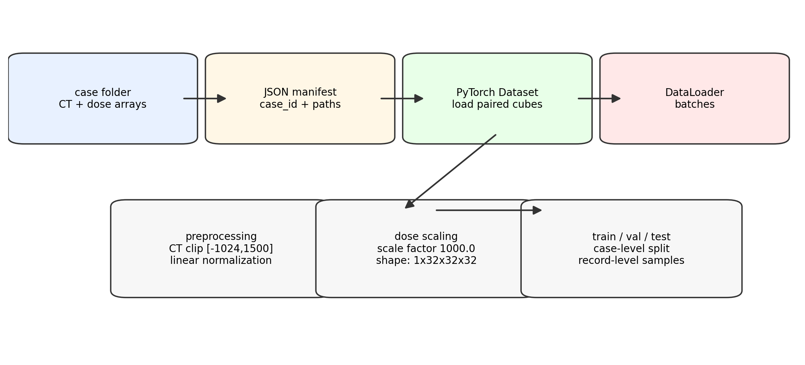
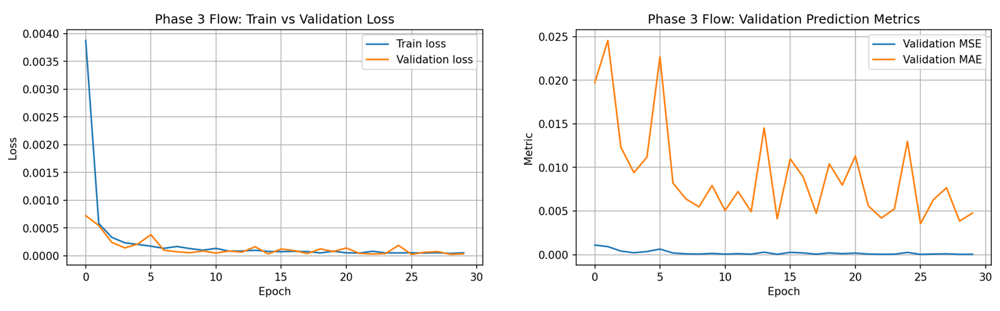
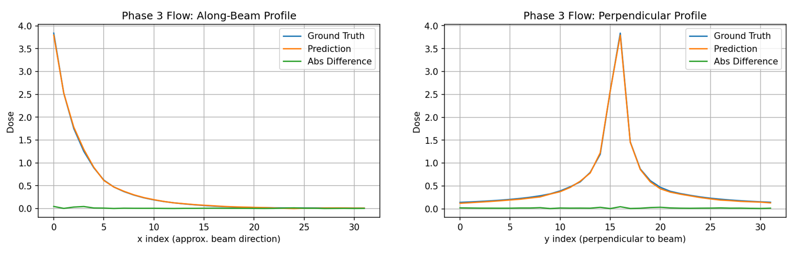
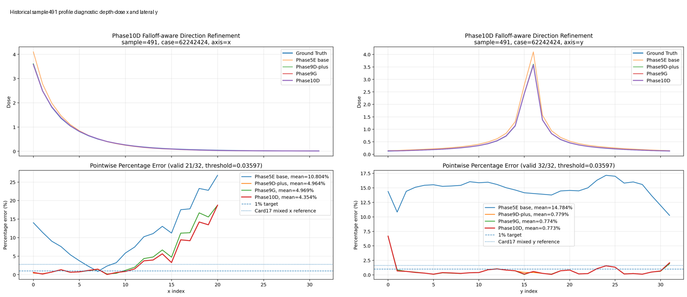
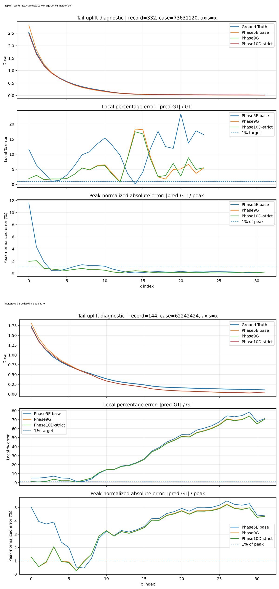

# 3D Rectified Flow Matching for CT-to-Dose Prediction

This repository documents an advanced-practice project on **3D CT-to-dose prediction** using 3D rectified flow matching and profile-aware refinement.

The task is to predict a `32 × 32 × 32` radiation dose cube from a paired `32 × 32 × 32` CT cube. The project started with a stable 3D rectified-flow baseline and later moved toward region- and profile-aware refinement, because global validation loss alone did not fully explain the quality of the predicted dose profiles.

> **Current status:** this repository is mainly a documentation and analysis repository. The raw CT/dose arrays and large model checkpoints are not included. The final report draft describes the project as a reader-facing research story: application → rectified flow matching → data loader and loss adaptation → stable baseline → hyperparameter optimization → evaluation metrics → hypothesis-driven refinements → corrected final evaluation.

---

## Project motivation

Radiotherapy dose prediction is a structured 3D regression problem. A useful model should not only minimize global voxel-wise error, but also preserve physically meaningful dose profiles:

- **depth-dose profile** along the beam direction,
- **lateral profiles** perpendicular to the beam,
- **high-dose core** behavior,
- **shoulder / transition-region** behavior,
- **falloff** and **low-dose tail** behavior.

The main question in the later project stage was:

> Can the remaining depth-dose profile error be reduced while preserving the already strong lateral profile behavior?

---

## Project workflow

<p align="center">
  
</p>

<p align="center">
  <em>Overview of the adapted 3D CT-to-dose data pipeline and PyTorch data loader.</em>
</p>

The main project-specific adaptations were:

1. custom data loaders for paired CT-dose cube manifests,
2. CT clipping and normalization,
3. dose scaling before training,
4. a conditional 3D U-Net velocity model,
5. a flow-matching velocity loss,
6. CT-initialized Euler sampling,
7. depth-dose and lateral-dose profile evaluation,
8. profile-aware refinement heads.

No single external GitHub repository was identified in the archived project files as the direct final code base for the 3D CT-to-dose experiments. The conceptual starting point is the rectified flow / flow matching formulation, and the implementation was adapted inside this project repository.

---

## Data setup

The project uses paired 3D CT-dose cubes.

### Cube representation

- CT cube shape: `1 × 32 × 32 × 32`
- dose cube shape: `1 × 32 × 32 × 32`
- CT preprocessing: clip to `[-1024, 1500]`, then linearly normalize
- dose preprocessing: scale by `dose_scale = 1000.0`

### Case-level split design

The intended split is case-level:

| Split role | Case groups | Notes |
|---|---:|---|
| training | 6 | used for model fitting |
| validation | 2 | used for model selection / diagnostics |
| final test | 2 | held-out case groups |

The full generated JSON files later contained many cube records per case:

| JSON file | Case groups | Records per case | Total records |
|---|---:|---:|---:|
| `train_pairs_3d.json` | 8 | 2000 | 16000 |
| `test_pairs_3d.json` | 2 | 2000 | 4000 |

The eight cases in `train_pairs_3d.json` correspond to the six training cases plus the two validation cases. Later, a corrected strict split was created for the final Phase10D-strict refinement-head evaluation.

---

## Baseline training and hyperparameter optimization

The first stable 3D rectified-flow baseline used sampled training and validation records.

| Item | Value |
|---|---:|
| training records | 2000 |
| validation records | 500 |
| base channels | 24 |
| batch size | 2 |
| learning rate | `3e-4` |
| epochs | 30 |
| best epoch | 26 |
| final validation MAE | 0.004768 |

Continuation from 30 to 50 epochs improved validation MAE to:

```text
0.002913
```

<p align="center">
  
</p>

<p align="center">
  <em>Joint training and validation curves for the stable 3D rectified-flow baseline.</em>
</p>

### Main Phase3 candidates

| Candidate | Learning rate | Base channels | Batch size | Val MAE | Role |
|---|---:|---:|---:|---:|---|
| Initial stable baseline | `3e-4` | 24 | 2 | 0.004768 | first stable 3D flow run |
| Continuation baseline | `3e-4` | 24 | 2 | 0.002913 | showed longer training helped |
| Manual tuned baseline | `5e-4` | 24 | 2 | 0.002662 | downstream baseline lineage |
| Optuna candidate | `1.6e-4` | 32 | 2 | 0.002421 | best Phase3 sampled-validation candidate |

The Optuna candidate achieved the lowest Phase3 sampled-validation MAE under global validation metrics. However, later Phase4--Phase10 experiments continued from the manually tuned `lr=5e-4`, `base_ch=24`, batch size 2 baseline and its derived systems. That branch had already been evaluated under the region- and profile-based analysis used in later project stages.

Therefore, this project distinguishes between:

- **best Phase3 sampled-validation candidate**: the Optuna candidate,
- **downstream baseline lineage**: the manually tuned baseline used for the later Phase4--Phase10 profile-refinement analysis.

---

## Evaluation framework

The project uses several evaluation layers.

### Global / system-level metrics

The earlier Phase4 system-level metric suite included:

- overall MAE,
- weighted MSE,
- high-dose MAE,
- outside-dose MAE,
- peak-core MAE,
- peak-shoulder MAE.

### Profile-level metrics

The later analysis uses:

- depth-dose profile error along the beam direction,
- lateral-dose profile error perpendicular to the beam,
- local percentage error,
- peak-normalized error,
- best / typical / worst diagnostic records.

<p align="center">
  
</p>

<p align="center">
  <em>Representative depth-dose and lateral-dose profile analysis.</em>
</p>

---

## Phase4 system-level metric result

The manually tuned baseline and a shoulder-aware variant were compared with the Phase4 system-level metric suite.

| Model | Overall MAE | Weighted MSE | High MAE | Outside MAE | Peak-core MAE | Peak-shoulder MAE |
|---|---:|---:|---:|---:|---:|---:|
| Tuned baseline | 0.002662 | 0.000038 | 0.004830 | 0.002382 | 0.047654 | 0.022622 |
| Shoulder-aware | 0.002683 | 0.000028 | 0.004179 | 0.002488 | 0.036051 | 0.015444 |

Interpretation:

- The tuned baseline remains the conservative global / outside-region reference.
- The shoulder-aware variant improves high-dose and peak-region metrics.
- This was an early sign that model selection depends on which aspect of dose quality is emphasized.

---

## Later profile-refinement work

After Phase4, the project shifted toward profile-level limitations.

The key finding was directional:

- Phase9G achieved strong lateral profile behavior.
- The remaining depth-dose / along-beam error was still high.

### Historical sample491 profile reference

The historical sample491 profile comparison was used as a representative depth-dose / lateral-dose diagnostic case.

| Method | Along-beam depth-dose x | Lateral / perpendicular y |
|---|---:|---:|
| Historical Phase4 mixed-weighted profile reference | 2.775% | 1.615% |
| Phase9G deployable | 4.969% | 0.774% |
| Phase10D-strict | 4.354% | 0.773% |

<p align="center">
  
</p>

<p align="center">
  <em>Historical sample491 profile diagnostic: Phase10D-strict reduces the depth-dose error while preserving lateral behavior.</em>
</p>

Interpretation:

- Phase10D-strict reduces the remaining depth-dose error.
- It preserves the lateral-profile advantage of Phase9G.
- It is still not a complete solution for typical and worst hard-profile records.

---

## Corrected strict evaluation caveat

Phase10D-strict follows a corrected refinement-head split protocol:

| Split | Role |
|---|---|
| strict train6 | train the Phase10D refinement head |
| strict val2 | validation / model selection pool |
| strict test2 | held-out test pool |
| stratified val/test subsets | reported diagnostic summaries |

However, Phase10D-strict is **not** a fully strict end-to-end retraining, because the upstream Phase5E / Phase9G base checkpoint is reused.

---

## Current remaining bottleneck

The current remaining bottleneck is **hard along-beam falloff-shape error**. The typical and worst diagnostic records show that Phase10D-strict improves the average depth-dose profile but does not fully solve hard-profile cases.

<p align="center">
  
</p>

<p align="center">
  <em>Tail/falloff diagnosis. Typical uplift is mostly a percentage-denominator effect; the worst record shows true falloff-shape failure.</em>
</p>

---

## Recommended next steps

1. Evaluate the Optuna-selected Phase3 candidate under the same region- and profile-level metrics.
2. Run full strict test2 evaluation when computational time is available.
3. Evaluate Phase10D-strict under the Phase4 system-level metric suite.
4. Analyze the hard-falloff cohort.
5. Design falloff-shape-specific refinement only after confirming the failure pattern.
6. If needed, perform fully strict end-to-end retraining.

---

## Repository notes

This repository is meant to support the report and project discussion. For reproducibility, raw data and large checkpoints should remain outside the public repository unless explicitly approved.
