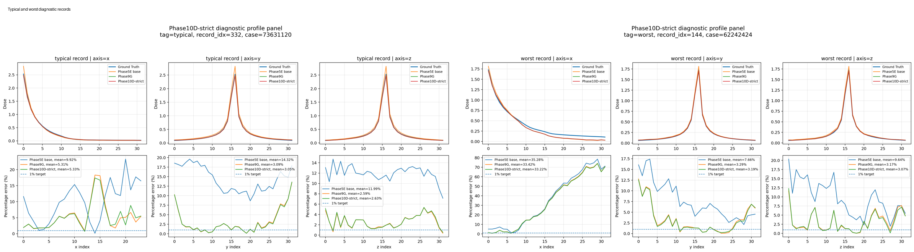

# Phase9--Phase11 Profile-Refinement Summary

This document summarizes the later profile-refinement work after the Phase4 system-level evaluation.

The main goal of these later experiments was to reduce the remaining **depth-dose / along-beam profile error** while preserving the already strong **lateral / perpendicular profile behavior**.

---

## Clear terminology

Older notebooks and Trello notes may contain short internal labels. In current documentation, the clearer descriptions below are preferred.

| Older internal label | Clearer description used here |
|---|---|
| Card17 | historical sample491 profile reference |
| Card31 | Phase4 system-level metric suite |

---

## Current best profile-refinement result

The current best split-corrected profile-refinement result is **Phase10D-strict**, a falloff-aware direction-refinement head.

On the historical sample491 profile reference:

| Method | Along-beam depth-dose x | Lateral / perpendicular y |
|---|---:|---:|
| Historical Phase4 mixed-weighted profile reference | 2.775% | 1.615% |
| Phase9G deployable | 4.969% | 0.774% |
| Phase10D-strict | 4.354% | 0.773% |

  

  <em>Historical sample491 profile diagnostic: depth-dose x and lateral y.</em>

Interpretation:

- Phase10D-strict reduces the remaining along-beam depth-dose error.
- It preserves the lateral-profile advantage of Phase9G.
- The improvement is conservative, not a complete solution.

---

## Strict evaluation caveat

Phase10D-strict follows a corrected refinement-head split protocol:

| Split | Role |
|---|---|
| strict train6 | train the Phase10D refinement head |
| strict val2 | validation / model selection pool |
| strict test2 | held-out test pool |
| stratified val/test subsets | reported diagnostic summaries |

However, Phase10D-strict is **not** a fully strict end-to-end retraining, because the upstream Phase5E / Phase9G base checkpoint is reused.

---

## Timeline of later refinement work

The later work can be understood as a hypothesis-driven sequence rather than a simple list of phases.

### Phase5: falloff-aware base direction

- **Observed limitation:** global validation error and system-level metrics did not fully explain profile behavior.
- **Hypothesis:** along-beam / falloff-aware training may improve depth-dose behavior.
- **Outcome:** useful but not sufficient; later diagnostics showed that profile-level evaluation was needed.

### Phase6--8: structured diagnostics

- **Observed limitation:** aggregate metrics could not explain why some records remained poor.
- **Hypothesis:** remaining errors depend on direction, dose region, and profile shape.
- **Outcome:** depth-dose and lateral-dose profiles, best/typical/worst records, and core/shoulder/falloff/tail regions became central diagnostics.

### Phase9: bounded and calibrated refinement

- **Observed limitation:** the base prediction had useful global structure but remaining local profile errors.
- **Hypothesis:** a bounded residual or multiplicative-additive calibration can correct local errors without destroying the base prediction.
- **Outcome:** multiplicative-additive calibration was more effective than purely additive correction. Phase9G became the strongest deployable profile baseline before Phase10.

### Phase10D: direction-aware falloff refinement

- **Observed limitation:** Phase9G gave strong lateral profile behavior but retained a high depth-dose error.
- **Hypothesis:** direction-aware and falloff-aware features can reduce depth-dose error while preserving lateral behavior.
- **Outcome:** Phase10D-strict improved the sample491 depth-dose error and preserved lateral behavior, but typical and worst hard-profile records remained unsolved.

### Phase10E and Phase11A: unsupported hypotheses

- **Phase10E:** dual-branch gated refinement did not improve along-beam x over Phase10D.
- **Phase11A:** approximate WED-aware features did not improve over Phase10D in the current implementation.

---

## Diagnostic records

Phase10D-strict was also evaluated on representative best, typical, and worst records.

| Record | x | y | z |
|---|---:|---:|---:|
| Best | 2.36% → 2.28% | 1.12% → 0.99% | 1.12% → 0.95% |
| Typical | 5.31% → 5.33% | 3.09% → 3.05% | 2.59% → 2.63% |
| Worst | 33.42% → 33.22% | 3.29% → 3.19% | 3.17% → 3.07% |

  

  <em>Typical and worst diagnostic records. The typical record remains above the desired 1% profile target, and the worst record is dominated by hard depth-dose falloff error.</em>

---

## Tail / falloff diagnosis

The tail-uplift analysis separates two different effects:

1. **Low-dose denominator effect:** local percentage error can rise when the true dose is small, even if the absolute error is small.
2. **True falloff-shape failure:** both local percentage error and peak-normalized error are high.

  

  <em>Tail/falloff diagnosis. Typical uplift is mostly a percentage-denominator effect; the worst record shows true falloff-shape failure.</em>

---

## Important inference note

The corrected rectified-flow sampler starts from CT, not zeros:

- initialization: CT,
- time mode: midpoint,
- integration sign: positive,
- Euler steps: 10 for the reproduced Phase9 / Phase10 profile analyses.

---

## Recommended next steps

1. Evaluate Phase10D-strict under the Phase4 system-level metric suite.
2. Run full strict test2 evaluation when computational time is available.
3. Analyze the hard-falloff cohort.
4. Test whether the Optuna-selected Phase3 candidate also performs better under region- and profile-level metrics.
