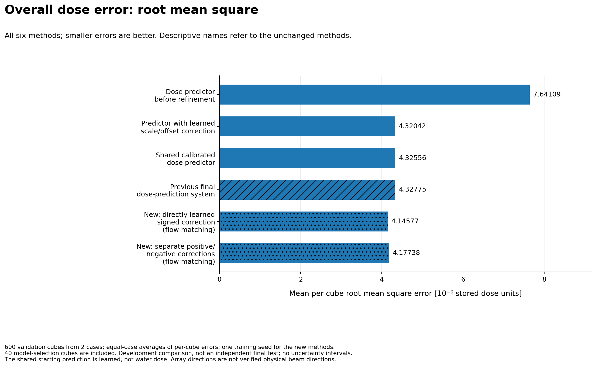
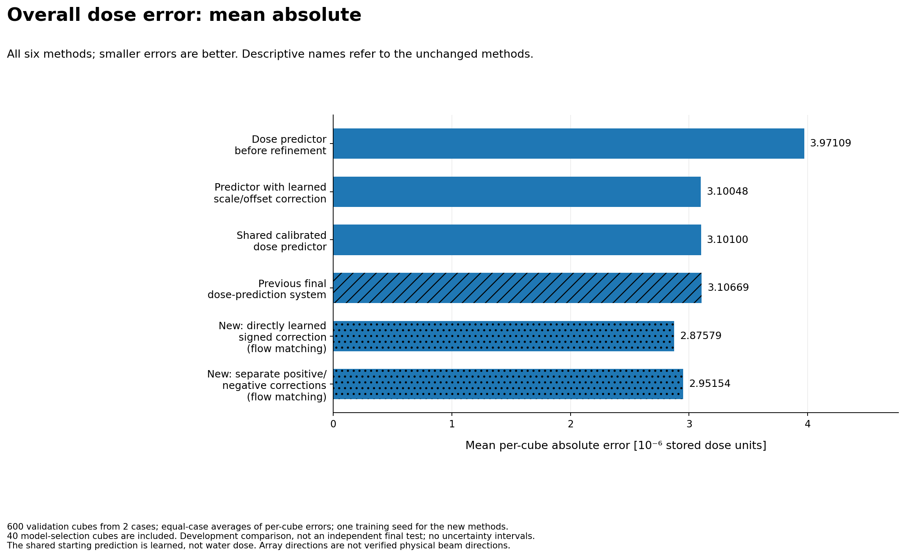
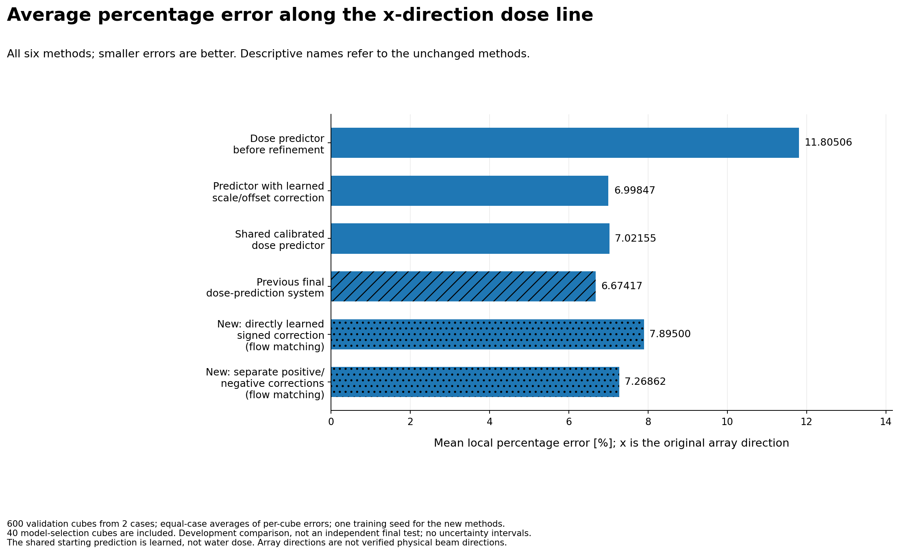
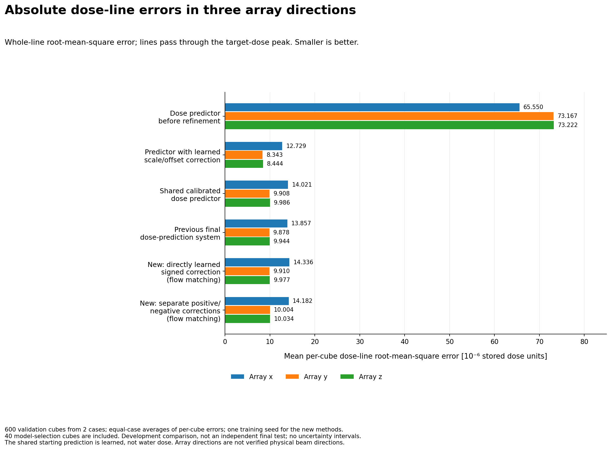
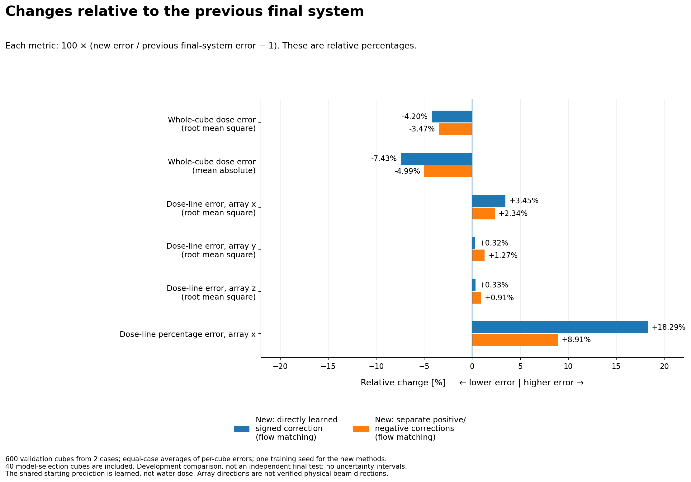
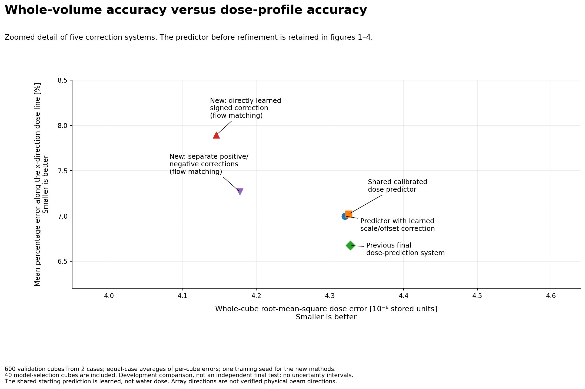
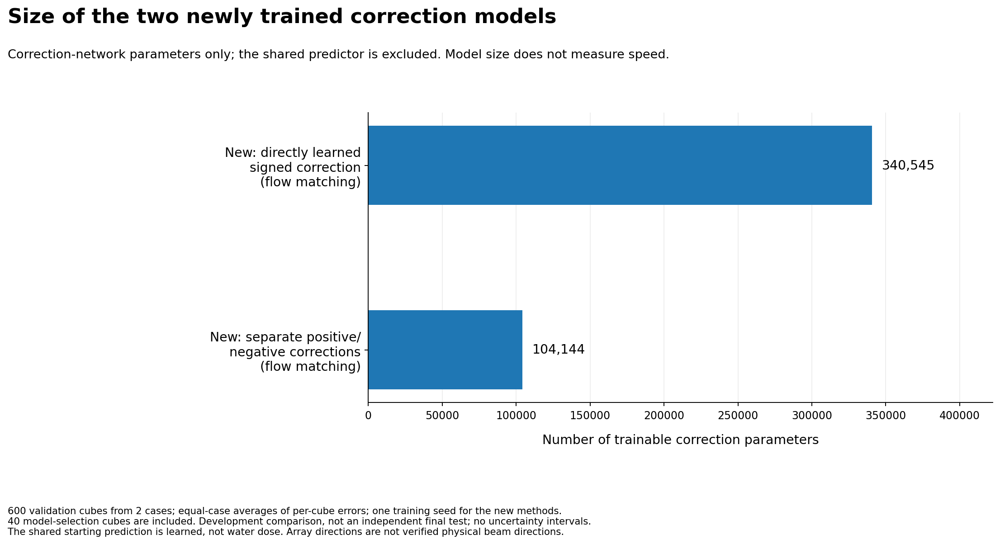

# Learning corrections to an existing dose-prediction system

## The question

Can we improve the final dose-prediction system from the master practical by learning its remaining error? We compared two new approaches using the same fixed, calibrated starting prediction: learning one signed correction field directly, or learning its positive and negative components separately.

The first uses rectified flow matching with direct signed-residual prediction. The second uses rectified flow matching with Hahn–Jordan decomposition. In this study, the reference for the correction is a previously learned predictor, **not water dose**. See [experiment overview](EXPERIMENT_OVERVIEW.md) for the shared inputs, correction target and reconstruction rule.

## Main result

Both new approaches lowered whole-cube dose errors relative to the previous final system, but neither improved its main x-direction dose-profile result. The positive/negative approach reduced the x-profile regression compared with the direct approach. This is a development comparison on 600 cubes from 2 cases with one training seed per new method, not an independent final test.

This folder contains presentation wording and figures only. The six original metric rows and their program identifiers are unchanged. Original model code, saved weights, run outputs and older release records are not replaced.

## Read without opening code

- [What each model does and what was measured](EXPERIMENT_OVERVIEW.md)
- [Complete Trello cards, grouped by status](TRELLO_CARDS.md)
- [Chinese/English terminology and exact code mapping](METHOD_NAMES_CN_EN.md)
- [How to use these revised files](HOW_TO_USE_CN.md)

## Figure gallery

The figures below use descriptive labels. The technical mapping remains available in the terminology file rather than being required to understand every plot. Root-mean-square error and mean absolute error are explained in the overview. Bars start at zero. No uncertainty intervals or significance estimates were added.


### Overall dose error: root mean square

All six methods. Each cube contributes a root-mean-square error, averaged within case and then equally across the two cases. Bars start at zero; the displayed factor of one million does not establish physical units.



[Vector image](figures/01_whole_cube_squared_error.svg)


### Overall dose error: mean absolute

All six methods in the same fixed order. Smaller values are better. Errors are in stored numerical units, multiplied by one million only for display.



[Vector image](figures/02_whole_cube_absolute_error.svg)


### Average percentage error along the x-direction dose line

The line passes through the target-dose peak along the original array x direction (array W). Percentage errors include only positions at or above1% of the target line peak; this is not a verified physical beam depth.



[Vector image](figures/03_x_dose_line_percentage_error.svg)


### Absolute dose-line errors in three array directions

Root-mean-square differences use the entire line. The three legacy array directions x/y/z correspond to W/H/D. All six methods are shown, including the upstream predictor; the relative-change figure resolves smaller differences.



[Vector image](figures/04_dose_line_errors.svg)


### Changes relative to the previous final system

For each metric separately, change=100*(new/previous final system-1). Negative means a lower error, positive a higher error. These are relative percentages, not percentage-point differences. They must not be summed into an overall score.



[Vector image](figures/05_changes_from_previous_system.svg)


### Whole-volume accuracy versus dose-profile accuracy

A zoomed detail view of the five correction systems. The upstream predictor remains in figures01-04. Both axes are errors and smaller is better. No connecting frontier, uncertainty interval or overall winner is inferred.



[Vector image](figures/06_volume_and_profile_accuracy.svg)


### Size of the two newly trained correction models

User-reported trainable correction-network parameters only. Shared upstream parameters, particle-reconstruction cost and runtime are not included. Parameter count is not a measure of latency.



[Vector image](figures/07_correction_model_size.svg)


## Reproduce the figures only

No GPU, PyTorch, trained weights or medical arrays are required. Dependencies: matplotlib and numpy. Use an environment where these dependencies are installed, then run:

```bash
python3 -m unittest discover -s tests -v
python3 make_figures.py --out /path/to/a/new/figure_directory
```

The renderer refuses a nonempty output directory. It reads the already reported aggregate CSV rather than training or evaluating any model.

## Evidence

`SOURCE_NOTES.json` records the origin and hash of the numerical input. `figures/FIGURES_RECORD.json` records the rendering inputs and generated-file hashes. `VERIFICATION.md` records software checks, not scientific acceptance. Trello and GitHub publication were not performed by generating this folder.
