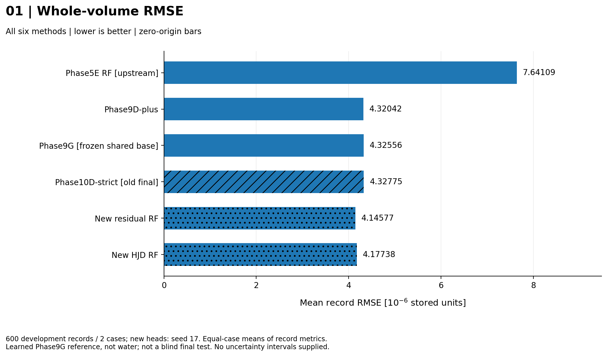
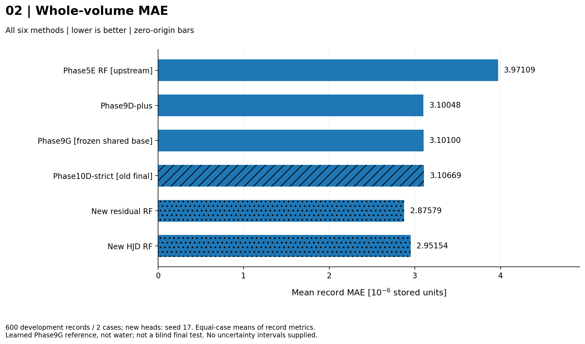
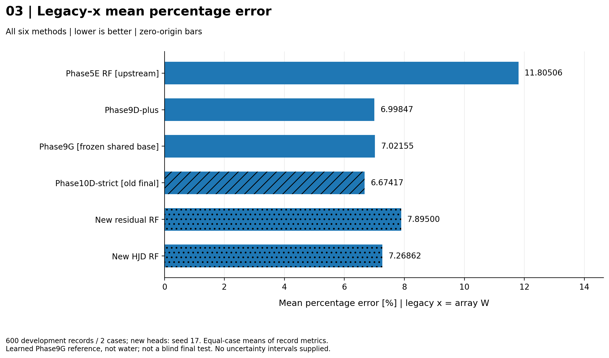
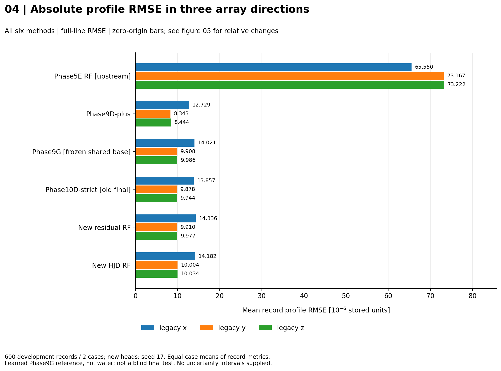
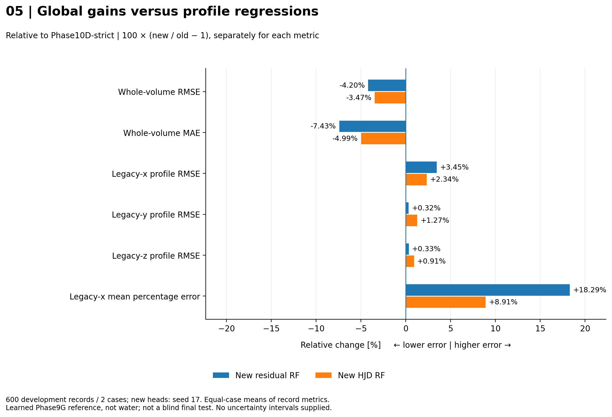
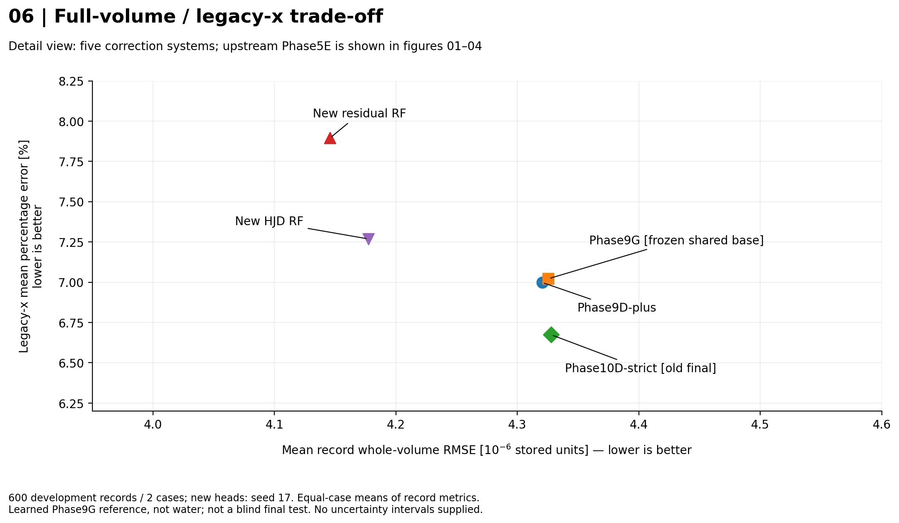
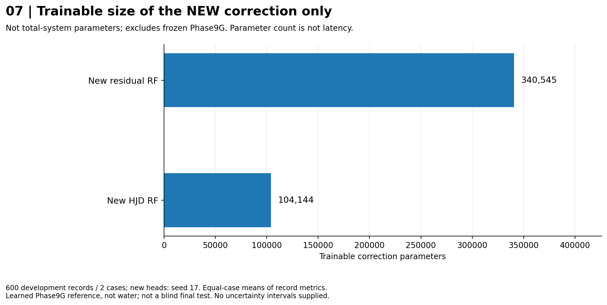

# Frozen V1 — visual comparison

These figures show the existing REAL Phase9G-error correction pilot; no new training or inference.
**600 validation records from 2 development cases; one new-model seed. No independent final-test, water-dose or clinical claim.**

Input provenance: `user_reported_aggregate`. Input CSV SHA256: `726e76f3b6bc285b413e7b95f8bdacc1630cb4929faa2722b32dd23f24057460`.
Parameter counts in figure 07 are the separately user-reported correction-network counts.

Bar charts use zero origins. Figure 06 is an explicitly zoomed scatter view.
No error bars are invented from aggregate means; mean record RMSE is not pooled RMSE.

Main observation: new global RMSE/MAE are lower, but absolute x/y/z profile RMSE is higher than Phase10D-strict.
This does not establish an overall winner, significance or where profile errors occur.

## Whole-volume RMSE

All six saved methods, in fixed lineage order; bars begin at zero. Values are means of record RMSEs, not one pooled RMSE.

## Whole-volume MAE

All six saved methods, same order and zero origin. Scaling by 10^6 is display only, not a conversion to Gy.

## Legacy-x percentage error

Mean local percentage error on the original GT-peak profile. The original evaluator keeps positions at least 1% of that GT line peak. Not an independently verified physical beam axis.

## Absolute profile RMSE

Whole-line absolute errors, one grouped figure for x/y/z. Legacy x=W, y=H, z=D. The large upstream RF bar is retained; figure 05 resolves smaller relative differences.

## Changes relative to Phase10D-strict

100*(new/Phase10D-1), computed separately for each metric. Negative means lower error; positive means higher error. These are relative percentages, NOT percentage-point differences and NOT a combined score.

## Global/profile trade-off

Detail view of five correction systems; the upstream Phase5E is excluded from this detail view only and remains in figures 01-04. Both axes are errors: lower left is better. Axes are zoomed and labeled. No connecting curve, significance claim, or Pareto guarantee.

## New correction-network size

Only the two newly trained correction networks. Counts come from the user-supplied resource table, not from timing. Shared upstream weights and runtime/particle costs are excluded; fewer parameters does not prove faster inference.

